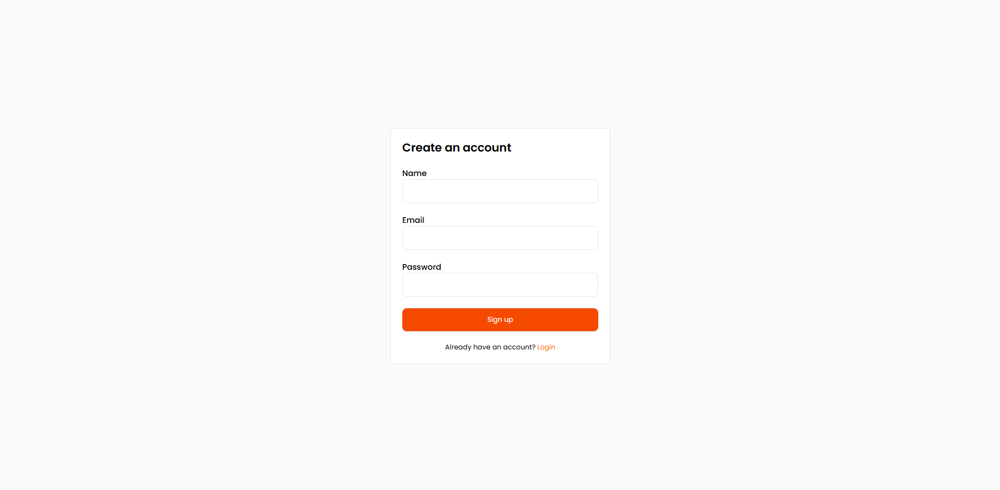
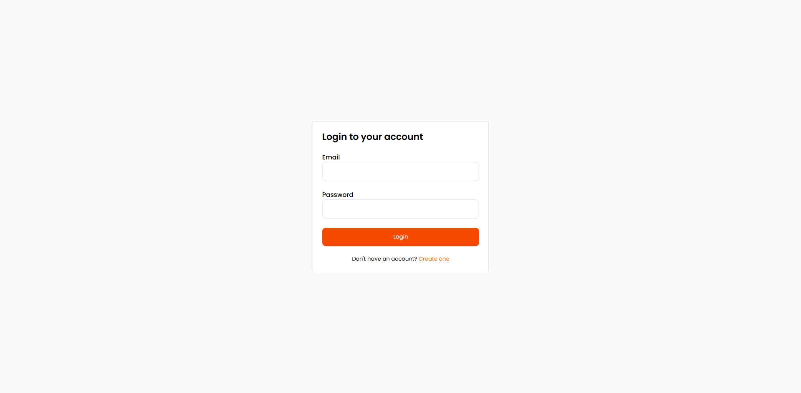
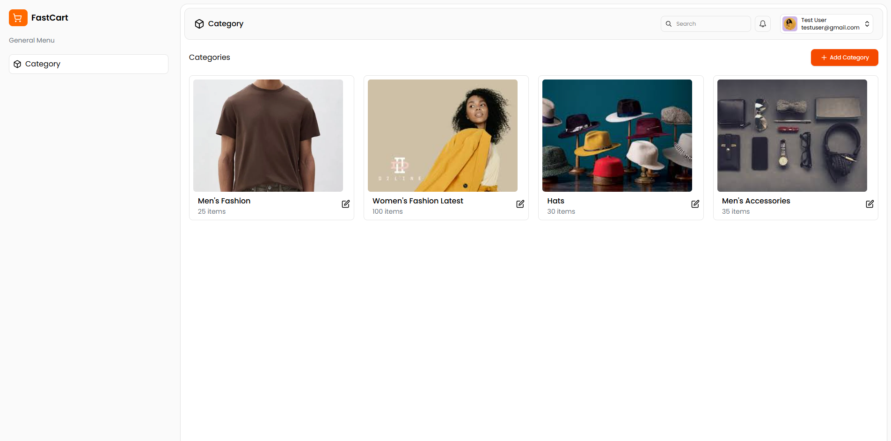
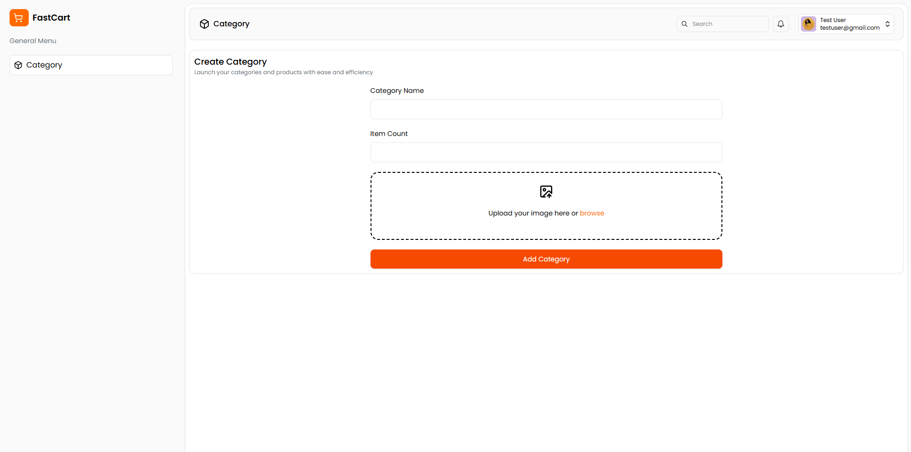
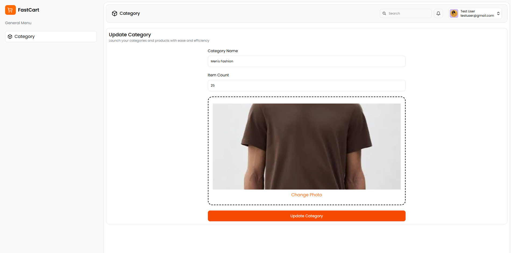

# 📝 Category Management Dashboard

A full-stack web application designed for managing categories with user authentication and intuitive UI/UX.

<div align="center">
  
  
  
  
  
</div>

## 🔧 Tech Stack

### Frontend:
- **React.js** – For building dynamic and responsive user interfaces.
- **TailwindCSS** – Utility-first CSS framework for fast UI development.

### Backend:
- **Node.js** – JavaScript runtime for building scalable server-side applications.
- **Express.js** – Fast, minimalist web framework for Node.js.

### Database:
- **MongoDB** – NoSQL database for storing category and user data.


## Features

- **User Authentication**
  - Secure login system using JWT tokens.
  
- **Category Management**
  - Create and update  categories with name, image, and item count.

- **Image Upload**
  - Upload and preview category images before submission.

- **Responsive UI**
  - Fully responsive dashboard interface with modern design using TailwindCSS.

- **Protected Routes**
  - Access to dashboard and category management only if the user is logged in.

---

## Folder Structure

```bash
├── client/               
└── server/                
```

## Get Started
1. Clone the repository
```
  git clone https://github.com/polineni1437/revisit-assignment.git
```
2. Navigate to client directory and install dependencies
```
  cd client
  npm install
```
3. Add a .env file in the root directory of client folder and add the below environment variables
```
  VITE_API_URL='your-server-url'
```
r. Navigate to server directory and install dependencies
```
  cd server
  npm install
```
5. Add a .env file in the root directory of server folder and add the below environment variables
```
  PORT=8000
  MONGODB_URI="your-mongodb-uri"
  CLIENT_URL="your-client-url"
  JWT_SECRET="jwt-secret-here"
```
6. Now, you can start your client and server in their respective directories by running the command.
```
  npm run dev
```
